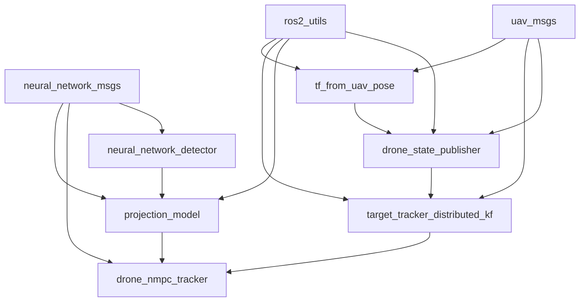

# AVIANS_ROS2_PORT1 项目总结

## 项目概述

AVIANS_ROS2_PORT1 是一个基于ROS2的无人机目标跟踪系统。该项目实现了从目标检测、状态估计到无人机控制的完整流程，用于无人机对地面目标（如行人）的自动跟踪。

## 包详细描述

### 1. custom_msgs (自定义消息包)
包含项目中使用的自定义消息类型定义。

#### 1.1 neural_network_msgs
- **描述**: 包含神经网络检测相关的消息定义
- **主要消息类型**:
  - NeuralNetworkDetection: 单个神经网络检测结果
  - NeuralNetworkDetectionArray: 神经网络检测结果数组
  - NeuralNetworkFeedback: 神经网络反馈信息
  - NeuralNetworkNumberOfDetections: 检测到的目标数量

#### 1.2 uav_msgs
- **描述**: 包含无人机通信的消息定义
- **主要消息类型**:
  - UAVPose: 无人机姿态信息

### 2. drone_description
- **描述**: 提供无人机模型、仿真世界和配置文件，用于Gazebo仿真
- **主要组件**:
  - 无人机模型 (x3)
  - 人物模型 (Walking_person)
  - 仿真世界 (drone_world.sdf)
  - 控制器 (waypoint_controller.cpp)

### 3. drone_nmpc_tracker
- **描述**: 实现非线性模型预测控制(NMPC)的无人机跟踪功能
- **依赖包**:
  - neural_network_msgs (检测消息)
  - geometry_msgs, nav_msgs, sensor_msgs (标准ROS消息)
  - tf2_ros, tf2_geometry_msgs (坐标变换)
- **主要功能**:
  - 基于NMPC的无人机控制器
  - 目标跟踪算法

### 4. drone_state_publisher
- **描述**: 发布无人机状态信息，将无人机里程计转换为UAV姿态，并生成用于人员跟踪的最佳视点路径点
- **依赖包**:
  - uav_msgs (UAV消息)
  - ros2_utils (工具函数)
  - nav_msgs, geometry_msgs (标准ROS消息)
- **主要功能**:
  - 无人机状态发布
  - 最优视点路径点生成

### 5. neural_network_detector
- **描述**: 基于神经网络的目标检测模块，使用YOLO算法实现
- **依赖包**:
  - neural_network_msgs (检测消息)
  - ros2_utils (工具函数)
  - cv_bridge, image_transport, opencv2 (图像处理)
- **主要功能**:
  - 图像目标检测
  - 检测结果发布

### 6. person_tracker
- **描述**: 人员跟踪器，使用YOLO检测器实现
- **主要功能**:
  - 人员检测与跟踪
  - 图像处理

### 7. pose_cov_ops_interface
- **描述**: 姿态协方差操作接口，用于姿态组合运算
- **依赖包**:
  - pose_cov_ops (姿态协方差运算库)
- **主要功能**:
  - 姿态协方差运算接口

### 8. projection_model
- **描述**: 投影模型，使用高度模型将对象检测投影到世界坐标系
- **依赖包**:
  - neural_network_msgs (检测消息)
  - pose_cov_ops_interface (姿态协方差接口)
  - ros2_utils (工具函数)
- **主要功能**:
  - 2D检测到3D世界的投影
  - 坐标变换

### 9. ros2_utils
- **描述**: ROS2工具集，包含共享的工具函数
- **依赖包**:
  - neural_network_msgs, uav_msgs (自定义消息)
- **主要功能**:
  - 时钟同步
  - 通用工具函数

### 10. target_tracker_distributed_kf
- **描述**: 分布式卡尔曼滤波目标跟踪器，用于3D目标跟踪
- **依赖包**:
  - uav_msgs (UAV消息)
  - ros2_utils (工具函数)
  - pose_cov_ops (姿态协方差运算)
- **主要功能**:
  - 3D目标跟踪
  - 分布式卡尔曼滤波算法

### 11. tf_from_uav_pose
- **描述**: 从UAV姿态数据发布TF变换和姿态消息
- **依赖包**:
  - uav_msgs (UAV消息)
  - ros2_utils (工具函数)
- **主要功能**:
  - TF变换发布
  - 姿态消息生成

## 包依赖关系

## 数据流和系统架构

1. **目标检测阶段**:
   - `neural_network_detector` 使用摄像头图像进行目标检测
   - 检测结果通过 `neural_network_msgs` 消息发布

2. **坐标投影阶段**:
   - `projection_model` 将2D检测结果投影到3D世界坐标系

3. **目标跟踪阶段**:
   - `target_tracker_distributed_kf` 使用卡尔曼滤波进行目标状态估计

4. **无人机控制阶段**:
   - `drone_state_publisher` 发布无人机状态并生成最优视点
   - `drone_nmpc_tracker` 使用NMPC算法控制无人机跟踪目标

5. **坐标变换**:
   - `tf_from_uav_pose` 处理坐标变换关系

## 总结

该项目构建了一个完整的无人机目标跟踪系统，从底层的传感器数据处理到高层的控制决策，形成了一个闭环的自动跟踪系统。各模块之间通过ROS2的消息传递机制进行通信，具有良好的模块化和可扩展性。
